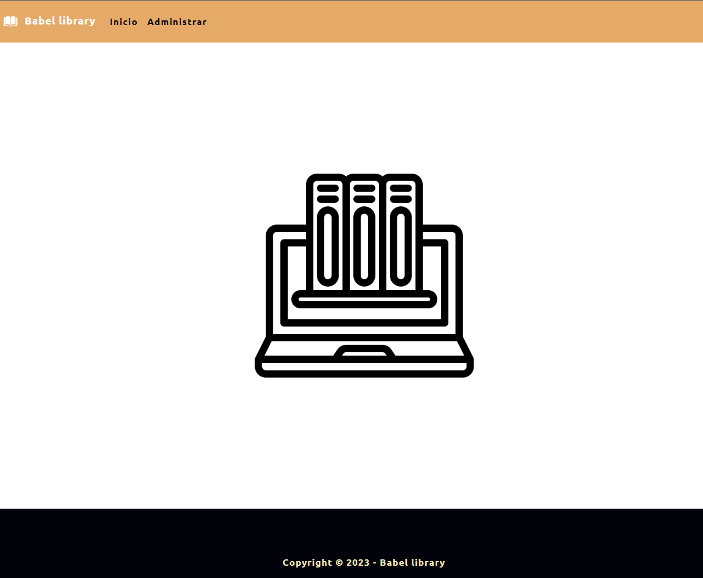
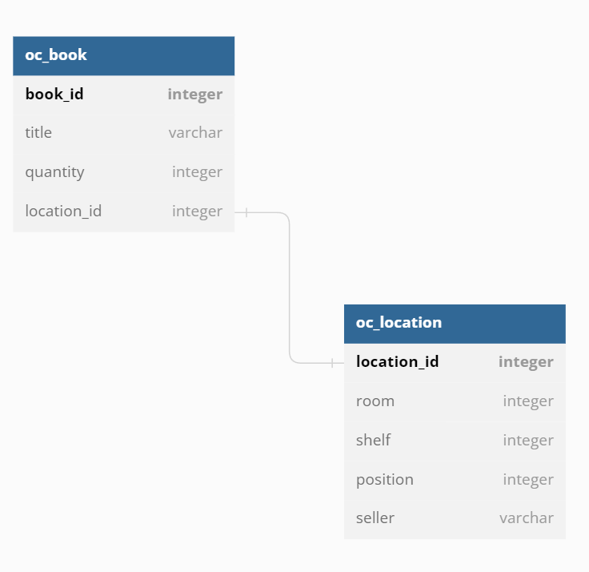

# Babel library 📚

Library manage app



## Description

A manage virtual books storage

## Getting Started

### Dependencies

* Node.js
* Maria DB

### Installing

* Create .env file if not exist with environment variables ( inside service folder ): 
```bash
# SERVICE 
SERVICE_NAME="Babylon library"
SERVICE_PORT=3900
JWT_SECRET_TOKEN="SECRET_HERE"
HTTP_REQUEST_TIMEOUT=15000

# DATABASE
DATABASE_TYPE='mariadb'
DATABASE_HOST="localhost"
DATABASE_USER="root"
DATABASE_PASSWORD="root"
DATABASE_NAME="babel_library"
DATABASE_PORT=3306
DATABASE_CONNECTION_TIMEOUT=15000
```

### Initial database script
```bash
# CREATE DATABASE SCRIPT
DROP DATABASE babel_library;
CREATE DATABASE babel_library;
USE babel_library;

CREATE TABLE IF NOT EXISTS oc_location (
location_id INT(11) NOT NULL AUTO_INCREMENT PRIMARY KEY,
room SMALLINT,
shelf SMALLINT,
position SMALLINT,
seller VARCHAR(255)
);

CREATE TABLE IF NOT EXISTS oc_book (
book_id INT(11) NOT NULL AUTO_INCREMENT PRIMARY KEY,
title VARCHAR(255),
quantity SMALLINT,
location_id INT(11),
CONSTRAINT book_location_fk FOREIGN KEY (location_id) REFERENCES oc_location(location_id) ON DELETE CASCADE ON UPDATE RESTRICT
);
```



* npm i ( inside app and service folder )
* npm build ( inside app and service folder ) # Production build

### Executing program

* npm run start:dev ( inside app and service folder ) # Run on development mode
* npm run start ( inside app and service folder ) # Run on production mode

## Authors

* Juan Carballo - jpcbdev@gmail.com

## Version History

[CHANGE LOG](/CHANGELOG.md)

## License

MIT

